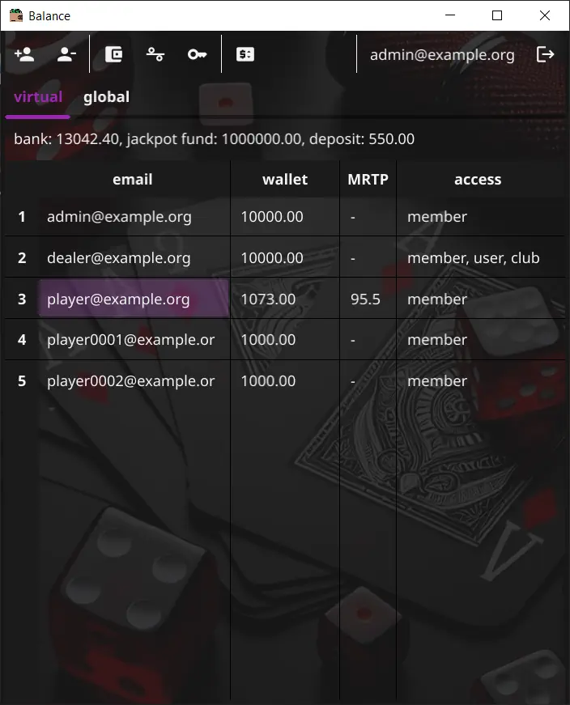

# Balance

[![Hits-of-Code][1]][2]

[1]: https://hitsofcode.com/github/slotopol/balance?branch=main
[2]: https://hitsofcode.com/github/slotopol/balance/view?branch=main

GUI tool application that helps to change users balance for Slotopol server.

On application starting, you need to log in with an account that has administrator rights to work with users. Next, you need to make a list of accounts to work with. This list is automatically saved. The buttons on the toolbar allow you to top up the balance for the selected user by specifying the amount of replenishment. You can also change the RTP of the selected user, in all games the reels will be selected with payments closest to the specified percentage. You can also change the access rights for accounts if your account itself has the appropriate rights. If your account has the right to access the club management, you can replenish / withdraw money from the bank, jackpot fund, and deposit.

When you start a new server instance with an empty database, 3 new accounts are automatically registered: admin, dealer, and player. You need to log in on start with the admin account `admin@example.org` with the password `0YBoaT`, after which you can perform any manipulations.

Note! Since the server is designed for monopoly usage of the database, direct editing of the database is only possible when the server is not running.

---
(c) schwarzlichtbezirk, 2024.
